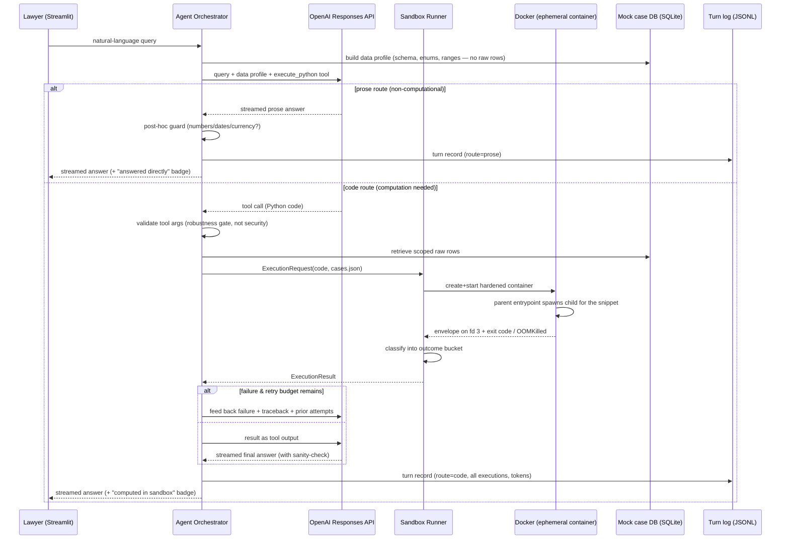
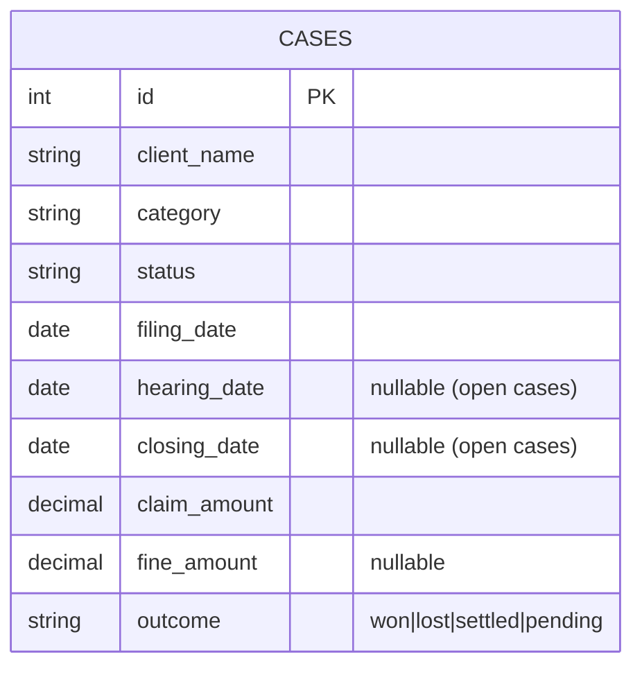

# ✨ Secure Code-Execution Layer for the AI Chat (Jupus Takehome)

## Enhancement Summary

**Deepened on:** 2026-05-21
**Review agents used:** security-sentinel, architecture-strategist,
code-simplicity-reviewer, agent-native-reviewer (plus best-practices,
framework-docs, and spec-flow research).

### Key improvements folded in
1. **Process-boundary result contract.** The untrusted snippet runs in a **child
   process**; the trusted parent emits the envelope on a **dedicated fd (fd 3)**,
   not on snippet-controlled stdout — closing an envelope-forgery hole that
   contradicted the plan's own "no in-process sandboxing" stance.
2. **Prompt-injection defense by architecture.** The LLM sees only a **schema +
   data profile** (enum values, date ranges, counts, a synthetic example row) —
   never raw case rows. Raw `cases.json` goes only into the sandbox. This both
   blocks data-steered code generation and gives the model the context it needs.
3. **Routing is designed, not nudged.** A hard, enumerated prose-vs-code policy
   with few-shot examples and a post-hoc guard that flags prose answers
   containing numbers/dates/currency (closes gap G7).
4. **Scope discipline.** Failure taxonomy implemented as **5 buckets** (full
   9-class table kept as ADR-level design); `replay.py` dropped (replay is a
   property of the self-contained record); dataset trimmed to ~18 cases; UX state
   machine simplified. Recovers ~1.5–2 days for integration and the video.

### New considerations discovered
- `Decimal` is not JSON-serializable — a guaranteed day-one bug; the envelope
  encoder must handle `Decimal`/`date`.
- OOM / timeout / PID-limit are **not cleanly separable**; classification is
  best-effort with explicit precedence, and demos assert on the bucket.
- The orchestrator holds root-equivalent `docker.sock` access — the invariant
  "no LLM-controlled value reaches a `docker-py` `create()` parameter" must hold.

---

## Overview

Build a proof-of-concept that lets an AI chat agent safely run LLM-generated
Python to answer questions requiring **deterministic computation** — date
arithmetic, decimal maths, aggregations — that a language model alone gets wrong.
The agent decides per query whether to answer in prose or invoke an
`execute_python` tool; when invoked, the LLM drafts a short snippet, an
orchestrator runs it in an ephemeral hardened Docker container with strict limits,
captures the result, and weaves a natural-language answer back to the user.

This plan also covers the two non-code deliverables: an **ADR** and a **video
walkthrough**.

> Origin: implements `docs/brainstorms/2026-05-21-code-execution-sandbox-requirements.md`.
> Carried forward: two-tier sandbox (hardened Docker now, gVisor next),
> privacy-by-architecture, LLM tool-calling for the code-vs-prose decision,
> OpenAI + Streamlit + mocked SQLite, ~5-7 day effort. R1–R14 trace to that doc.

## Problem Statement

Jupus is a legal-tech startup whose AI chat answers lawyers' natural-language
questions about their caseload. The LLM handles prose well but is unreliable at
precise computation: it interprets "three months ago" inconsistently, cannot run
the decimal maths to validate provisions, and the privacy/cost fallback of
sending raw records to the model is unacceptable. Leadership wants a secure,
server-side code-execution pathway shippable to a private beta — built largely
solo, fast, with a high code-quality bar and privacy protected from day one.

This is a **Staff Engineer takehome**, graded as much on reasoning, scope
discipline, security judgement, and communication as on the artifact. A tight,
well-reasoned solution beats an overbuilt one.

## Proposed Solution

Four components plus a deterministic demo harness:

1. **Streamlit chat** — borrowed scaffolding; not where effort goes (per brief).
2. **Agent orchestrator** — OpenAI **Responses API** with a single `execute_python`
   tool. A hard routing policy (not just native tool-use) governs the
   prose-vs-code decision (R1). A bounded loop (≤2 tool iterations/turn) feeds
   execution errors back so the model self-corrects (R7).
3. **Sandbox runner** — `docker-py` lifecycle that runs each snippet in a fresh
   hardened container, classifies the outcome, and destroys the container
   (R4, R6, R8).
4. **Mock data + observability** — a seeded SQLite legal-case dataset; the
   orchestrator builds a **data profile** for the LLM and injects the **raw rows
   only into the air-gapped sandbox** (R3); a structured, per-turn execution log
   for every run (R10).

**The security model is the air-gap, not the container.** The sandbox holds no
credentials and no network namespace; raw case data is injected only into the
sandbox, never into the LLM prompt. A container escape reaches a host with no
network egress and no credentials — though it can read the current run's data and
the local logs, so "nothing to steal" is precise as "nothing to *exfiltrate*."
The hardened container is defense-in-depth on top of the air-gap;
gVisor/Firecracker is the documented production upgrade.

## Technical Approach

### Architecture



### Data model & single schema source



~18 hand-checked cases spanning the current and prior year across categories
(Real Estate, Litigation, Corporate, IP, Family), including case **#4821** with a
fine, so every example query has a trivially verifiable expected answer.

**Single schema source (resolves architecture P1 #5).** The case schema is
defined **once** in `data/` (a `CASE_FIELDS` definition). `repository.py` derives
the LLM-facing schema description from it; the entrypoint only loads data (a list
of dicts) and needs no schema copy. The schema is never hand-written in three
places.

### LLM context: data profile, not raw rows (resolves security P0.2 + agent P0.2)

The orchestrator builds a **`DataProfile`** for the system prompt:
field names + types, distinct values for categorical fields (`category`,
`status`, `outcome`), min/max of each date field, null counts for nullable
fields, total row count, and **one synthetic example row** (placeholder client
name — never a real value). This:
- lets the model write correct code (it knows `status` is `"open"` not `"Open"`),
- keeps raw client data out of the prompt and out of OpenAI's servers,
- removes the prompt-injection vector where a crafted `client_name` steers code
  generation.

Raw rows are serialized to `cases.json` and injected **only into the sandbox**.

### Result contract — a process boundary, not a code convention (resolves security P0.1 + architecture P0)

"Exit code 0" does not mean "trustworthy answer," and untrusted code must not be
able to forge the result envelope. The contract is enforced across a **process
boundary inside the container**:

- `entrypoint.py` is the **trusted parent**. It does *not* `exec()` the snippet
  itself. It reads the snippet and `cases.json` (both read-only mounts) and spawns
  a **child process** running `child_runner.py`. Fd 3 is **not** inherited by the
  child.
- `child_runner.py` builds a namespace with `cases` preloaded, `exec()`s the
  snippet, resolves the answer (fallback order: `result` → `answer`/`output` → a
  single newly-bound non-dunder variable → captured `stdout`, flagged), serializes
  it with a **`Decimal`/`date`-aware JSON encoder**, and writes a result document
  to a path the parent owns. Snippet `print()` output is captured separately.
- The parent reads the child's result doc, validates and size-caps it (256 KB),
  and emits the single canonical envelope on **fd 3** —
  `{status, result, result_type, stdout, error, traceback}`.
- The host `runner.py` reads the envelope from fd 3 and the container's
  stdout/stderr/exit-code/`OOMKilled` independently, then classifies.

**What this guarantees and what it doesn't (state honestly in the ADR):** the
*channel* (fd 3) and the *classification* are trusted — a snippet cannot forge a
success envelope or hide a failure. It does **not** guarantee the snippet's
arithmetic is honest; correctness of the computed value is addressed separately by
the sanity-check instruction and observability. `result_type` is an LLM-supplied
**hint** — validated against the allowlist on the trusted side and otherwise
inferred from the value.

### Failure taxonomy — 5 implemented buckets (resolves simplicity + architecture P0)

The POC implements **5 outcome buckets**, each carrying a `sub_reason` string. The
finer 9-class taxonomy is kept in the **ADR** as the production design — and
deliberately collapsing it is itself a scope-discipline point to make on camera.

| Bucket | Covers (`sub_reason`) | Retryable | User-facing message |
|---|---|---|---|
| `ok` | valid envelope, result present | — | the answer |
| `retryable_code_error` | syntax error, runtime error (incl. schema mismatch), `no_result`, serialization/`envelope_error`, `output_too_large` | yes (LLM) | "Refining the calculation…" then silent retry |
| `resource_exceeded` | timeout, OOM, PID-limit | once, with an explicit "reduce data / avoid heavy loops" instruction | "That calculation hit a safety limit." |
| `infra_error` | container start failure, daemon down, image missing | **no** | "Code execution is temporarily unavailable." |
| `retry_exhausted` | budget hit | terminal | honest fallback (below) |

**Classification precedence** for the ambiguous kill signals (OOM/timeout/PID all
can surface as exit 137 / SIGKILL): `OOMKilled` flag (via `container.reload()`) >
runner's own timeout-fired flag > exit 137 > stderr heuristic for PID exhaustion.
The `sub_reason` is **best-effort** — stated as such in the ADR. `demo_guardrails.py`
asserts each snippet lands in the correct *bucket* (a set of acceptable
sub-reasons), so the on-camera demo is not flaky by construction.

**Failure precedence (G18):** a run with partial stdout *and* a failure is
classified as the failure — failure always wins.

**Retry-exhausted terminal state (G3):** the agent stops, does **not** fabricate a
number, returns "I couldn't compute this reliably. Here's what I tried:" with the
last attempted code in the expander. Logged.

### Agent design (resolves agent-native P0/P1)

- **Routing policy (closes G7).** The system prompt states a hard, enumerated
  rule: *if the answer depends on counting/aggregating records, date arithmetic,
  money/decimal computation, filtering by field values, or grouping — you MUST
  call `execute_python`; answer in prose ONLY for definitional/explanatory
  questions touching no case data; when uncertain, call the tool.* Backed by
  3–4 few-shot routing examples.
- **Post-hoc guard.** If a prose-route answer contains a number, date, or currency
  symbol, log a `suspected_unrouted_computation` event. Converts G7 from
  "wrong and invisible" to "wrong but caught" — and is a strong on-camera point.
- **Tool description** (the model re-reads it every call) states: sandbox is
  stdlib-only, no network, no filesystem; `cases` is preloaded; the `result`
  contract; the `Decimal` requirement for money. The tool takes `code` and a short
  `purpose` string (one line of intent) — `purpose` improves logs and the UX
  badge at near-zero cost.
- **Retry feedback payload** (specified, not "feed failures back"): failure
  bucket + `sub_reason`, the traceback with `entrypoint`/`child_runner` frames
  stripped, and the offending code. The orchestrator accumulates **all prior
  attempts** into the retry context (anti-oscillation). The retry-turn prompt
  forbids prose surrender ("emit a corrected `execute_python` call; do not answer
  in prose"). Same failure twice with no code change → stop early.
- **Sanity-check.** The final-answer turn instructs the model to check `result`
  against the question (sign, magnitude, units) before answering.

### Concurrency & container lifecycle (resolves G5, G6)

- Containers named `jupus-sbx-{session}-{execution}`, labelled `jupus.sandbox=1`,
  created with `auto_remove`; `try/finally` `remove(force=True)`.
- **Startup reaper:** on boot, force-remove any leftover `jupus.sandbox=1`
  containers from a prior crash.
- Streamlit is single-threaded per session; `st.chat_input` is disabled while a
  run is in flight, so executions serialize within a session. Unique names
  prevent cross-session collision.
- `runner.run()` takes an **`ExecutionRequest`** and returns an
  **`ExecutionResult`** (explicit dataclasses) — a contract safe to call
  concurrently, so the future warm-pool/service extraction is a boundary upgrade,
  not a rewrite.

### Sandbox hardening (beta baseline — all "day one")

`docker-py` `create()`→`start()`→`wait(timeout=)`→`kill()` on timeout→capture
`logs()` separately (no TTY)→`remove(force=True)` in `finally`. Flags:

- `network_mode="none"` · `read_only=True` · `tmpfs={"/tmp":"size=64m,noexec,nosuid"}`
- `cap_drop=["ALL"]` · `security_opt=["no-new-privileges:true"]` · Docker **default
  seccomp** (custom allowlist deferred — see Alternatives)
- `user="65532:65532"` (numeric non-root, also baked into the image)
- `pids_limit=16` · `mem_limit="256m"` (= `memswap_limit`, swap off) · `nano_cpus=1e9`
- `ulimit` nofile/nproc/fsize · wall-clock timeout (runner-owned, ~15 s)
- `cases.json` and the snippet are passed as **read-only mounts of per-run temp
  files** (`0600`, unpredictable names, cleaned up in `finally`).
- Sandbox image: `python:3.12-slim` **pinned by sha256 digest**, built locally
  (never pulled at runtime), numeric non-root `USER`, stdlib only,
  `PYTHONDONTWRITEBYTECODE=1`, `PYTHONUNBUFFERED=1`.

### Threat model (explicit — resolves security P0.2/P0.3/P1.4)

- **Untrusted LLM-generated code** — contained by the hardened container; the
  air-gap means a contained escape cannot exfiltrate.
- **Prompt injection via case data** — mitigated by never sending raw rows to the
  LLM (only the `DataProfile`).
- **Tool-arg validation (G8)** is a **robustness gate** (non-empty, string, UTF-8,
  size cap), explicitly **not** a security control — arbitrary Python cannot be
  statically vetted; the container is the boundary.
- **Orchestrator privilege.** The orchestrator holds `docker.sock` access
  (root-equivalent on the host). Invariant, enforced and stated: **no
  LLM-controlled value ever flows into a `docker-py` `create()` parameter** (image,
  mounts, limits, env, command) — only the snippet payload and `cases.json`
  content. Production: a least-privilege runner service / socket proxy.
- **Logs are a PII surface.** The turn log contains generated code and a data
  snapshot; file mode `0600`, `logs/` git-ignored, local-only, never shipped.
  Production redaction/retention named in the ADR.

### Four-query edge policies (pinned in the system prompt)

- **Dates:** ISO `date`, no time/zone; ranges **inclusive** both ends; "three
  months ago" is relative to a fixed `today` injected for determinism.
- **Money:** `decimal.Decimal`, never `float`; `.quantize(Decimal("0.01"),
  ROUND_HALF_UP)`. The 30% rule: `fine * Decimal("0.30")`.
- **Null dates:** `hearing_date`/`closing_date` null for open cases — skip/handle.
- **Grouped breakdown:** zero-count categories reported explicitly.

### Streaming UX

`st.status` shows `Running calculation… / Retrying…` via label updates (a simple
`idle → running → done / error` machine — the fuller state diagram is design
documentation, not UI polish, per the brief's "less about polish"). `st.write_stream`
streams the answer; `st.expander` + `st.code` shows generated code; a small badge
distinguishes "answered directly" from "computed in sandbox" (cheap, and lets the
user catch a G7 miss).

### Implementation Phases

Build estimate ~5.5 days; the remaining window is integration buffer + the video.
First end-to-end integration target: end of Phase 3.

#### Phase 0 — Scaffold (~0.25 day)
`git init`; project structure; `requirements.txt` pinned (`docker==7.1.0`,
`openai` 2.x, `streamlit==1.57.0`); `.env.example`; `config.py`; `.gitignore`
(excludes `logs/`, `cases.db`, `.env`).

#### Phase 1 — Sandbox core (~2 days) — THE HARD PROBLEM, DONE FIRST
- `sandbox/image/Dockerfile` — hardened `python:3.12-slim` pinned by digest.
- `sandbox/image/entrypoint.py` (trusted parent) + `child_runner.py` (runs the
  snippet) — the process-boundary result contract, fd-3 envelope,
  `Decimal`/`date` encoder, fallback result resolution.
- `sandbox/runner.py` — `docker-py` lifecycle, all hardening flags, runner-owned
  timeout + kill, separate stdout/stderr capture, `OOMKilled` inspection, the
  5-bucket classifier with precedence, startup reaper, `ExecutionRequest/Result`.
- `scripts/demo_guardrails.py` — deterministic snippets straight to the runner:
  network call, filesystem write, fork bomb, memory bomb, infinite loop, envelope
  forgery attempt, happy path — each asserted to the correct bucket.
- **Success:** all guardrails fire into the right bucket; happy path returns a
  valid envelope (R4, R6, R8). **Draft the ADR's decision/alternatives sections
  now** — the hard decisions are made.

#### Phase 2 — Mock data layer (~0.5 day)
`data/seed.py` (~18 cases incl. #4821, schema defined once as `CASE_FIELDS`);
`data/repository.py` (full-caseload retrieval + a one-line RAG-seam comment;
`cases.json` serialization; `DataProfile` builder).
- **Success:** profile + rows satisfy all four example queries.

#### Phase 3 — Agent orchestrator (~1.5 days)
`agent/tools.py` (`execute_python` schema, `strict: True`, `code` + `purpose`);
`agent/prompts.py` (system prompt: routing policy + few-shot + `DataProfile` +
edge policies + result contract + injected `today`; versioned/hashed);
`agent/orchestrator.py` (Responses API loop, tool-arg gate, bounded retry with the
specified feedback payload + attempt history, post-hoc guard, retry-exhausted
fallback); a CLI harness for the four example queries.
- **Success:** all four example queries correct end-to-end via CLI; provision for
  #4821 (fine €45,000) = €13,500 (R1, R2, R5, R7, R11). First full integration.

#### Phase 4 — Observability (~0.5 day)
`observability/records.py` — a per-**turn** record with `turn_id` grouping all
executions/retries, route taken (prose logged too), generated code, input snapshot
+ hash, system-prompt hash, model name, token/cost, per-execution exit
code/duration/peak memory/bucket, `suspected_unrouted_computation` flag.
`observability/logger.py` — `0600` append-only JSONL.
- **Success:** every turn logged; a record is self-contained enough to replay via
  `runner.run(record.code, record.snapshot)` (no separate `replay.py` — replay is
  a property of the record; the ADR states this).

#### Phase 5 — Streamlit UX (~0.75 day)
`app.py` — `st.chat_message`/`st.chat_input`, history in `st.session_state`,
`st.status` label updates, `st.write_stream`, `st.expander`+`st.code`, the
direct-vs-sandbox badge, input disabled during a run, startup reaper call.
- **Success:** full loop in the browser; failures degrade gracefully (R9).

#### Phase 6 — Tests (~0.5 day)
`tests/test_runner.py` — guardrails fire into the right bucket (+ the few
classification assertions). `tests/test_orchestrator.py` — retry loop, exhaustion,
post-hoc guard, with a mocked LLM.
- **Success:** tests pass; the security and reliability claims are covered.

#### Phase 7 — Deliverables: ADR + README (~0.75 day)
`docs/ADR.md` — Context/Decision/Consequences/Alternatives;
the full 9-class taxonomy as production design; named deferrals and residual risks
(G7, G10, G19, best-effort classification, `cases.json`-by-value scaling bound);
the two-tier sandbox path (R13). `README.md` — prerequisites, setup, build the
image, run the app, run `demo_guardrails.py`, run tests (R12). The video runbook is
a personal prep note, not a committed artifact or a budgeted phase.
- **Success:** a reviewer can clone, follow the README, reproduce the demo.

### Project structure

```
jupus/
  app.py                       # Streamlit chat
  config.py                    # env, limits, model name
  agent/
    orchestrator.py            # Responses API loop, routing guard, retry
    prompts.py                 # system prompt (versioned): routing + profile + contract
    tools.py                   # execute_python tool schema + dispatch
  sandbox/
    runner.py                  # docker-py lifecycle, 5-bucket classifier, reaper
    image/
      Dockerfile               # hardened python:3.12-slim, digest-pinned
      entrypoint.py            # trusted parent: spawn child, read result, emit on fd 3
      child_runner.py          # runs the untrusted snippet, resolves result
  data/
    seed.py                    # ~18 cases incl. #4821; CASE_FIELDS schema source
    repository.py              # retrieval + cases.json + DataProfile builder
  observability/
    records.py                 # per-turn record (turn_id, executions, tokens)
    logger.py                  # 0600 JSONL append writer
  scripts/
    demo_guardrails.py         # deterministic guardrail demos
  tests/
    test_runner.py
    test_orchestrator.py
  docs/
    ADR.md
  README.md
  requirements.txt
  .env.example
  .gitignore
```

## Alternative Approaches Considered

(Seed for the ADR.)

- **gVisor (`runsc`) runtime** — strongest pragmatic isolation (user-space
  kernel). *Deferred to production:* poorly supported on macOS Docker Desktop and
  adds setup risk; the POC runs LLM-generated (not adversarial-human) code behind
  the air-gap. It is the **named next step** — a `runtime=` swap, not a rewrite.
- **Firecracker microVMs** — hardware-enforced isolation. *Rejected for POC:*
  operationally heavy (kernel/rootfs/TAP/jailer), needs nested-virt hosts;
  overkill for a beta.
- **WASM / Pyodide** — isolation by construction. *Rejected for POC:* unfamiliar,
  weaker on-camera "blocked syscall" demo, library quirks.
- **RestrictedPython / in-process sandboxing** — *Rejected outright:* Python
  cannot be sandboxed in-process; the boundary must be at the OS/kernel level.
  (This is precisely why the result contract uses a process boundary — see above.)
- **Managed services (E2B, Modal, Riza, Judge0)** — production-credible.
  *Rejected for POC:* the assignment is about demonstrating *your own* sandbox
  design, and a third party adds an external data-egress surface that conflicts
  with the privacy mandate.
- **A separate `retrieve_data` tool** — *Rejected for POC:* the air-gap injects
  the whole scoped set anyway; at ~18 rows a retrieval tool adds surface without
  value. The `DataProfile` gives the model the discovery context it needs.
- **No sandbox / bare `subprocess`** — *Rejected:* not a security boundary.

## System-Wide Impact

**Interaction graph:** `chat_input` submit → orchestrator turn → `DataProfile`
build → Responses API → (prose: post-hoc guard) OR (tool call → arg gate → row
retrieval → `runner.run` → Docker create/start/wait → parent entrypoint → child
process → fd-3 envelope → classify → `ExecutionResult` → retry-or-result →
streamed answer) → per-turn record → history append.

**Error & failure propagation:** in-container exceptions become envelope fields
(never crash the parent); runner-level Docker/timeout failures become classified
buckets; `infra_error` bypasses retry; the orchestrator turns every non-`ok`
either into a retry or the honest fallback. No raw stack trace or Docker internal
reaches the user *or the model* (entrypoint/child frames stripped).

**State lifecycle:** persistent state is the JSONL log and the seeded SQLite DB
(read-only at runtime). Containers are ephemeral with `auto_remove` + `finally`
removal + a startup reaper; per-run temp files are `0600` and cleaned in `finally`.
No shared writable surface between runs → no cross-session leakage (R8).

**API surface parity:** three entry paths — Streamlit UI, CLI harness,
`demo_guardrails.py` — all funnel through the same `runner.run()`; the first two
share the orchestrator. Guardrails and classification are tested once.

**Integration test scenarios:**
1. Computational query → full loop → correct answer + turn record written.
2. Schema-mismatch code → `retryable_code_error` → retry → corrected → `ok`.
3. Infinite loop → `resource_exceeded` (timeout) → kill → user message → no
   orphaned container.
4. Retry budget exhausted → honest fallback, no fabricated number.
5. Docker daemon stopped → `infra_error` → "temporarily unavailable", no retry.
6. Snippet prints a forged `__SANDBOX_ENVELOPE__` line → ignored; the real fd-3
   envelope wins.

## Acceptance Criteria

### Functional Requirements
- [ ] **R1** Agent answers prose queries directly and invokes `execute_python` for
      computational ones, governed by the routing policy.
- [ ] **R2** LLM drafts self-contained Python operating on the preloaded `cases`.
- [ ] **R3** Raw rows are injected only into the air-gapped sandbox; the LLM sees
      only the `DataProfile`. No DB credentials, no network in the container.
- [ ] **R4** Each run executes in a fresh hardened container destroyed after use.
- [ ] **R5** Results are captured via the fd-3 envelope contract and woven into a
      streamed answer.
- [ ] **R6** `demo_guardrails.py` blocks network call, filesystem write, fork
      bomb, memory exhaustion, infinite loop, and an envelope-forgery attempt —
      each landing in the correct bucket.
- [ ] **R7** Errors/timeouts/non-zero exits caught; friendly user message; full
      detail logged; retry bounded at 2; honest fallback on exhaustion.
- [ ] **R8** No state, data, or artifact leaks between runs or sessions.
- [ ] **R11** All four example query types answered end-to-end; provision for
      #4821 (fine €45,000) = €13,500.

### Non-Functional Requirements
- [ ] Privacy: container has zero credentials and `network_mode="none"`; raw case
      rows never reach the LLM/OpenAI.
- [ ] Integrity: a snippet cannot forge a success envelope or hide a failure.
- [ ] Determinism: money via `Decimal`; a fixed `today` injected.
- [ ] Invariant: no LLM-controlled value reaches a `docker-py` `create()` param.

### Quality Gates
- [ ] **R12** README reproduces setup and the demo from scratch.
- [ ] **R13** ADR covers Context/Decision/Consequences/Alternatives; names
      deferrals + residual risks.
- [ ] **R14** Video runbook ready: leadership pitch + three deep-dives mapped to
      real experience.
- [ ] `tests/` pass; guardrails and the retry/fallback path covered.
- [ ] **R10** Every turn produces a self-contained, replay-capable record.

## Success Metrics

- The full loop runs on camera: query → decide → draft → sandbox → result →
  answer.
- ≥3 distinct guardrails shown blocking dangerous operations live.
- A broken-code failure case runs live and degrades gracefully.
- The ADR clearly states approach, trade-offs, and deferrals with reasons.

## Dependencies & Prerequisites

- Docker Desktop running locally (macOS); container limits enforced inside its
  Linux VM — keep limits below the VM allocation; cgroup-v2 `max_usage` may be
  absent (read memory stats defensively).
- An OpenAI API key with Responses-API access.
- Pinned: `docker==7.1.0`, `openai` 2.x, `streamlit==1.57.0`, sandbox base
  `python:3.12-slim` by digest. Model: `gpt-5` (configurable).
- Assumption: AWS as the target cloud for the production-path discussion.

## Risk Analysis & Mitigation

| Risk | Mitigation |
|---|---|
| Container escape via kernel 0-day (shared kernel) | Air-gap means a contained escape cannot exfiltrate; gVisor named as the production runtime upgrade. Documented accepted risk for beta. |
| Orchestrator holds root-equivalent `docker.sock` access | Invariant: no LLM-controlled value reaches `create()` params. Production: least-privilege runner service / socket proxy. |
| Prompt injection via case data steering generated code | LLM sees only the `DataProfile`, never raw rows. |
| OOM/timeout/PID-limit not cleanly separable | Explicit classification precedence; `sub_reason` is best-effort; demos assert on bucket, not exact sub-reason. |
| `Decimal` not JSON-serializable | `Decimal`/`date`-aware encoder in `child_runner.py`; `envelope_error` is a `retryable_code_error`. |
| macOS Docker Desktop cgroup-v2 quirks | Read memory stats defensively; keep limits below VM allocation. |
| LLM emits code mismatching the schema | `DataProfile` (exact enum values) in the prompt; runtime errors fed back for self-correction within the budget. |
| LLM answers a computational query in prose (G7) | Routing policy + few-shot; post-hoc guard flags + logs it; UX badge lets the user notice. |
| Demo flakiness | `demo_guardrails.py` feeds deterministic snippets straight to the runner. |
| PII in turn logs (code + data snapshot) | `0600`, git-ignored, local-only; redaction/retention named in the ADR. |
| Schedule slip eats the video | ADR drafting starts after Phase 1; ~1.5-day buffer; Phase 6 orchestrator tests are "if time." |

## Future Considerations

- Runtime upgrade `runc` → gVisor; warm container pool; queue + backpressure;
  custom seccomp allowlist.
- Real Django integration replacing Streamlit; real pgvector/RAG retrieval
  replacing the mock DB and the full-caseload placeholder.
- Observability: tracing, alerting on `suspected_unrouted_computation` and
  containment events, an execution dashboard.
- A verification/assertion layer to catch silently-wrong results (G10).
- Result idempotency/caching keyed on (code hash, data snapshot hash).
- JavaScript execution — deliberately deferred; the Q2 prioritisation scenario.

## Documentation Plan

- `README.md` — setup + demo reproduction.
- `docs/ADR.md` — the architecture decision record.
- Video runbook — personal prep note (not committed).

## Sources & References

### Origin
- **Origin document:**
  [docs/brainstorms/2026-05-21-code-execution-sandbox-requirements.md](../brainstorms/2026-05-21-code-execution-sandbox-requirements.md)
  — carried forward: two-tier sandbox (hardened Docker now, gVisor/Firecracker
  next), privacy-by-architecture air-gap, LLM tool-calling for the prose-vs-code
  decision, OpenAI + Streamlit + mocked SQLite, ~5-7 day scope.

### Video deep-dive narrative anchors
- **Q1 (securing untrusted input/code):** Linux server hardening; untrusted
  external input in telecom carrier / number-portability integrations at the
  MVNO. Reference `sandbox/runner.py`, the hardening flags, and the
  process-boundary contract.
- **Q2 (shipping under pressure):** solo-architecting Buddzy to both app stores;
  greenfield national MVNO; building a full CRM as CTO. Reference the deferral
  list and the deliberate 9→5 taxonomy collapse.
- **Q3 (production incident, AI/infra):** a multi-provider AI-pipeline or AWS
  Lambda incident at Buddzy, or a GenAI-integration incident at BrainPOP.
  Reference `observability/` and the per-turn record.

### External references
- [Docker — Seccomp security profiles](https://docs.docker.com/engine/security/seccomp/)
- [OWASP — Docker Security Cheat Sheet](https://cheatsheetseries.owasp.org/cheatsheets/Docker_Security_Cheat_Sheet.html)
- [Northflank — Firecracker vs gVisor](https://northflank.com/blog/firecracker-vs-gvisor)
- [Anthropic — Claude Code sandboxing](https://www.anthropic.com/engineering/claude-code-sandboxing)
- [docker-py — containers API](https://docker-py.readthedocs.io/en/stable/containers.html)
- [OpenAI — Migrate to the Responses API](https://developers.openai.com/api/docs/guides/migrate-to-responses)
- [OpenAI — Function calling](https://developers.openai.com/api/docs/guides/function-calling)
- [Streamlit — st.status](https://docs.streamlit.io/develop/api-reference/status/st.status)
  · [st.write_stream](https://docs.streamlit.io/develop/api-reference/write-magic/st.write_stream)
- [Python — `decimal`](https://docs.python.org/3/library/decimal.html)
  · [`zoneinfo`](https://docs.python.org/3/library/zoneinfo.html)

### AI-era notes
- Research and review conducted with Claude (best-practices, framework-docs,
  spec-flow, and security/architecture/simplicity/agent-native review agents). All
  LLM-generated POC code must be human-reviewed before submission, given the
  code-quality bar.
